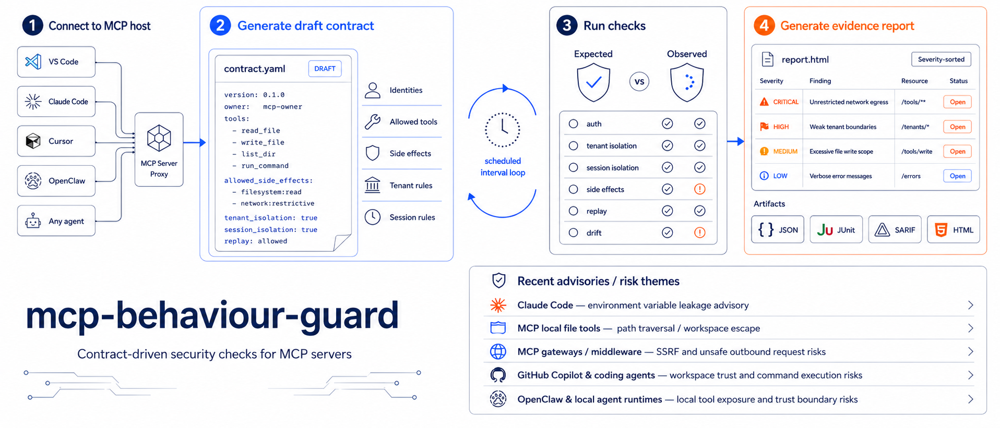
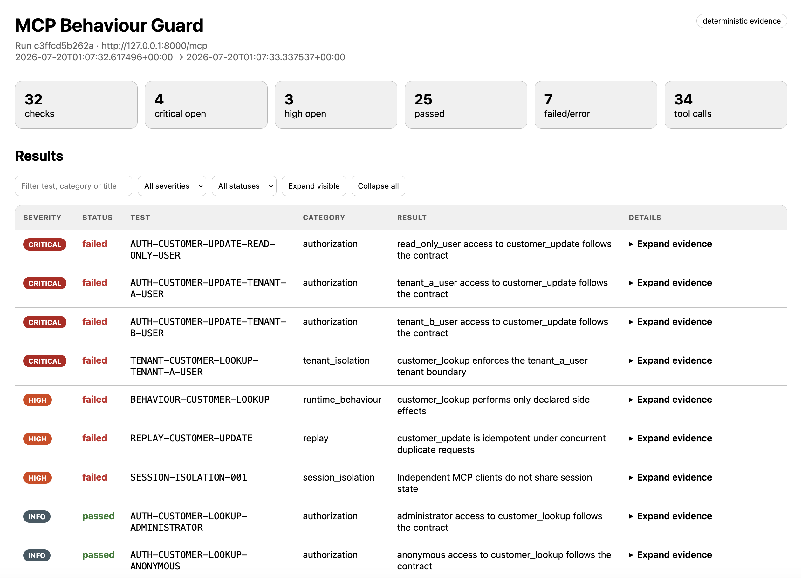
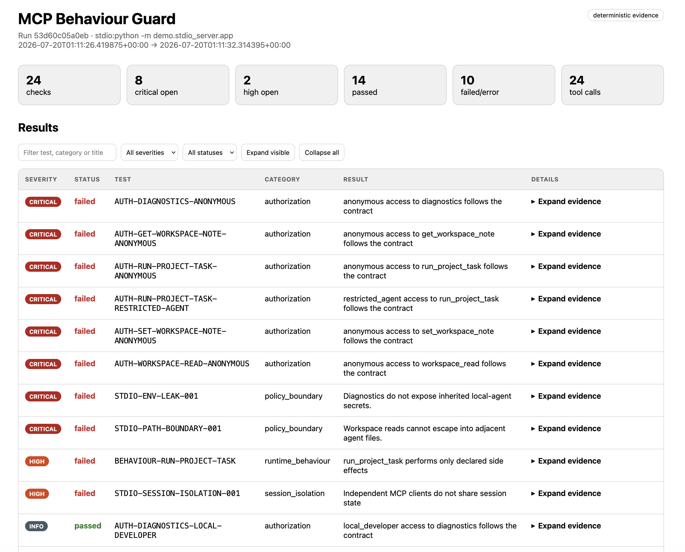
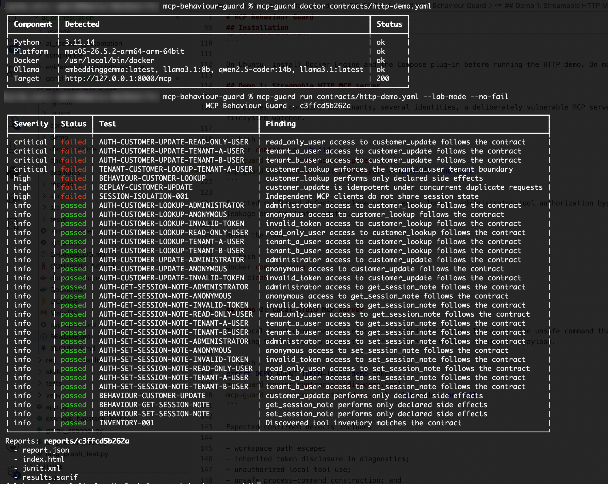
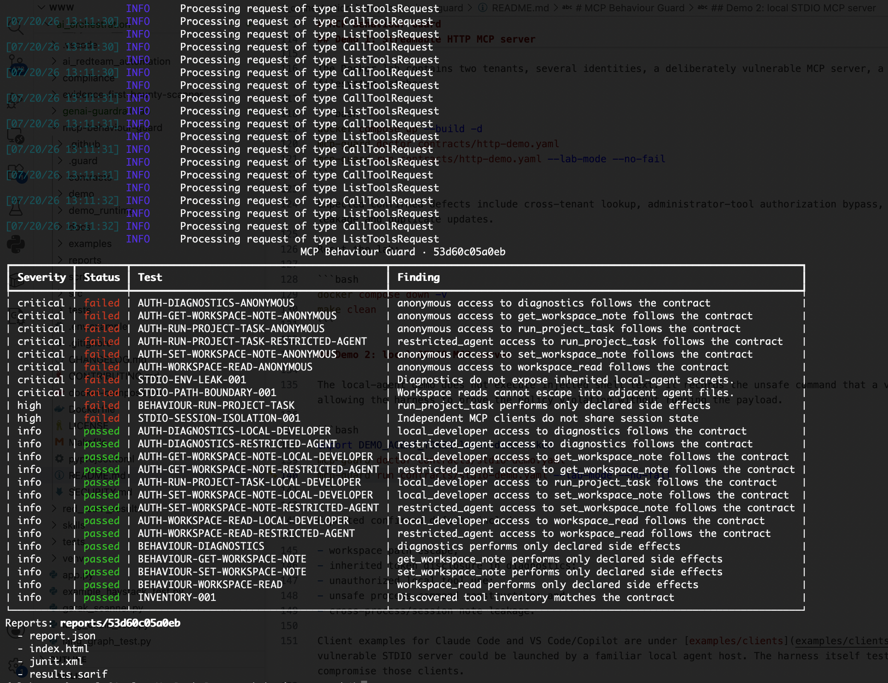
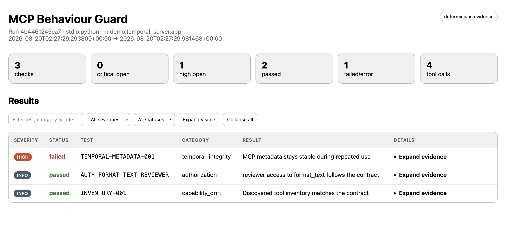
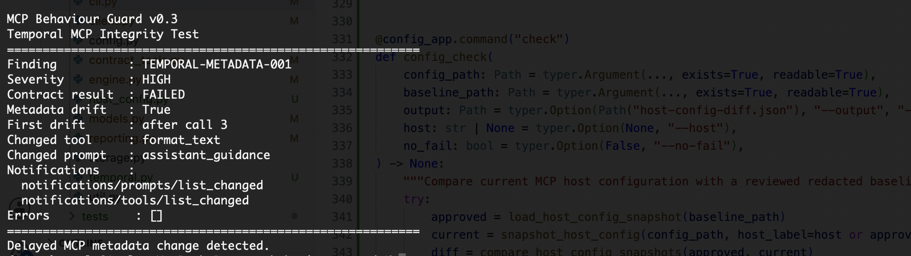
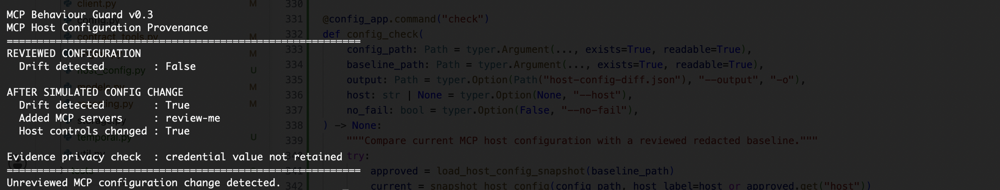

<p align="center">
  
</p>

<h1 align="center">mcp-behaviour-guard</h1>

<p align="center">
  <strong>Contract-driven security and behavioural regression testing for MCP servers.</strong>
</p>

<p align="center">
  Discover an MCP server, define what it is allowed to do, test its actual runtime behaviour, and generate reproducible evidence when the observed behaviour violates the contract.
</p>

<p align="center">
  <a href="#quick-start">Quick start</a> •
  <a href="#what-it-tests">Security checks</a> •
  <a href="#generate-a-draft-contract">Generate a contract</a> •
  <a href="#reports-history-and-monitoring">Reports</a> •
  <a href="#safety-and-limitations">Limitations</a>
</p>

---

## Why this project exists

MCP servers can expose files, commands, databases, APIs, email systems and other sensitive capabilities to coding assistants and AI agents.

Tool descriptions and input schemas explain what a tool claims to do, but they do not prove that the server:

* Enforces user and tenant boundaries.
* Keeps sessions isolated.
* Avoids undeclared filesystem or network activity.
* Prevents duplicate state-changing operations.
* Preserves the same security behaviour between releases.

`mcp-behaviour-guard` tests these properties against an explicit YAML security contract.

> Define the permitted behaviour, execute controlled tests, observe the result, and report deviations with reproducible evidence.

## Workflow

1. Connect to an HTTP or STDIO MCP server.
2. Discover its tools and generate a draft security contract.
3. Review identities, permissions, tenant rules and permitted side effects.
4. Run deterministic authorization and behavioural checks.
5. Optionally re-test the same MCP session and fingerprint tool/prompt/resource metadata for runtime drift.
6. Repeat scans at a configured interval when monitoring is enabled.
7. Generate severity-ordered HTML, JSON, JUnit and SARIF evidence.

Contract generation produces a starting point, not an automatically trusted security policy. Authorization rules and permitted side effects must be reviewed by someone who understands the target system.

## What it tests

When explicitly configured in the security contract, the current MVP supports:

* Tool discovery and capability inventory
* Anonymous and invalid-token access
* Identity-based tool authorization, with reusable role policies for tenant expansion
* Configured cross-tenant resource probes
* Session and context isolation
* Undeclared network requests visible to configured observers
* Undeclared filesystem writes inside configured observation paths
* Replay and duplicate-execution tests behind the existing safety gate
* Tool-inventory and behavioural baseline drift
* Runtime-gated tool/prompt/resource metadata drift across repeated calls
* MCP host-configuration provenance and drift checks
* Scheduled scans and severity-filtered alerts

## Evidence-first reporting

Findings are ordered by severity, with critical findings displayed first. Each report row can be expanded to show:

* The identity and tool used
* Test input
* Expected contract decision
* Observed runtime behaviour
* Evidence and trace locations
* Remediation guidance

<p align="center">
  
  
</p>

<p align="center">
  
  
</p>

## Quick start

### Requirements

- Python **3.11**; Docker and CI are pinned to **3.11.14**
- macOS or Ubuntu
- Docker Desktop/Engine with Compose for the HTTP lab
- No Docker requirement for the basic STDIO lab

### Install

```bash
pyenv install 3.11.14
pyenv local 3.11.14

python -m venv .venv
source .venv/bin/activate
python -m pip install --upgrade pip
python -m pip install -e '.[dev]'
cp .env.example .env
```

### Run the HTTP lab

```bash
docker compose up --build -d
mcp-guard doctor contracts/http-demo.yaml
mcp-guard run contracts/http-demo.yaml --lab-mode --no-fail
```

### Run the STDIO lab

```bash
export DEMO_AGENT_TOKEN=local-demo-token
mcp-guard doctor contracts/stdio-demo.yaml
mcp-guard run contracts/stdio-demo.yaml --lab-mode --no-fail
```

### Run the temporal-integrity demo

This harmless demo keeps one STDIO session open, makes repeated calls, and changes its own tool/prompt metadata after the third call. It never reads credentials, files or network data.

```bash
mcp-guard doctor contracts/temporal-demo.yaml
mcp-guard run contracts/temporal-demo.yaml --no-fail
```

The expected result is a **high** `TEMPORAL-METADATA-001` finding with the first drift recorded after call 3.

Reports are written to `reports/<run-id>/index.html`.

The local development patch is not published to PyPI. Its [evidence status guide](docs/evidence-status.md) explains why a denied result needs a positive control and why an observer outage is inconclusive. For direct Python use:

```python
import asyncio
from mcp_behaviour_guard import run_contract

result = asyncio.run(run_contract("contracts/stdio-demo.yaml", lab_mode=True))
print(result.summary.assessment.value, result.run_dir)
```

For a runner image separate from the deliberately vulnerable Docker demo:

```bash
docker build -f Dockerfile.runner -t mcp-guard-runner:dev .
docker run --rm -v "$PWD:/work" mcp-guard-runner:dev run contracts/stdio-demo.yaml --lab-mode --no-fail
```

The container can reach only mounted files and networks available from its runtime. This demo mounts the checkout read-write because the STDIO lab writes controlled fixtures under `demo_runtime/stdio`; do not use an unrestricted read-write source checkout mount for production runner jobs. The demo's original `Dockerfile` and Compose setup remain unchanged.

## Architecture and evidence flow

```text
MCP server definition
        |
        v
Tool/schema discovery  --->  conservative draft contract
                                   |
                                   v
                       human-reviewed security policy
                                   |
                  +----------------+----------------+
                  |                                 |
          Streamable HTTP                      STDIO process
                  |                                 |
                  +----------------+----------------+
                                   |
                 identities + tenant/session/replay probes
                                   |
                  declared and independent observers
                                   |
                                   v
              deterministic findings + reproducible evidence
                                   |
          SQLite | HTML | JSON | JSONL | JUnit | SARIF | alerts
```

The YAML contract is the expected policy. The MCP server's own tool descriptions are discovery input, not the source of authorization truth.

## Generate a draft contract

The generator connects to the **underlying MCP server**, discovers its tools and schemas, and creates a conservative YAML draft. It cannot safely infer who should be authorized, which tenant owns an object, which test data is safe, or which side effects are approved.

After generation, review all `REVIEW_REQUIRED` values, identities, probes and side-effect rules before running a scan.

### From VS Code with GitHub Copilot

VS Code stores MCP definitions in a workspace `.vscode/mcp.json` or a user-profile `mcp.json`. Copy the server's `command`, `args`, `cwd` and required environment mapping.

Example VS Code definition:

```json
{
  "servers": {
    "memory": {
      "type": "stdio",
      "command": "npx",
      "args": ["-y", "@modelcontextprotocol/server-memory"]
    }
  }
}
```

Generate the draft:

```bash
mcp-guard contract generate \
  --transport stdio \
  --name memory \
  --command npx \
  --arg=-y \
  --arg=@modelcontextprotocol/server-memory \
  --output contracts/memory-draft.yaml
```

For a remote server from `mcp.json`:

```bash
export MCP_ACCESS_TOKEN='replace-me'

mcp-guard contract generate \
  --transport streamable-http \
  --name remote-tools \
  --url https://mcp.example.com/mcp \
  --bearer-token-env MCP_ACCESS_TOKEN \
  --output contracts/remote-tools-draft.yaml
```

### From Claude Code

Inspect the configured server:

```bash
claude mcp list
claude mcp get <server-name>
```

Use the displayed command and arguments with the same STDIO generator. For example, a server added as:

```bash
claude mcp add --transport stdio local-tools -- python -m my_server.app
```

can be discovered with:

```bash
mcp-guard contract generate \
  --transport stdio \
  --name local-tools \
  --command python \
  --arg=-m \
  --arg=my_server.app \
  --output contracts/local-tools-draft.yaml
```

### From OpenClaw

OpenClaw can run as a STDIO MCP server using `openclaw mcp serve`. Generate a draft directly from that server process:

```bash
mcp-guard contract generate \
  --transport stdio \
  --name openclaw \
  --command openclaw \
  --arg=mcp \
  --arg=serve \
  --output contracts/openclaw-draft.yaml
```

The OpenClaw gateway and any required authentication must already be configured. Use `--server-env CHILD_ENV=SOURCE_ENV` when the child process requires environment variables without storing secret values in the contract.

### Cursor, Windsurf, Gemini CLI, and other hosts

The host application is not the scan target; its configured MCP server is. Find the server entry in the host's MCP settings and map it as follows:

| Host field | `mcp-guard contract generate` |
|---|---|
| Local `command` | `--command` |
| Each local argument | repeated `--arg` |
| Working directory | `--cwd` |
| Child-process environment | repeated `--server-env CHILD_ENV=SOURCE_ENV` |
| Remote URL | `--url` with `--transport streamable-http` |
| Bearer credential | `--bearer-token-env` |

Generic local example:

```bash
mcp-guard contract generate \
  --transport stdio \
  --name project-tools \
  --command uvx \
  --arg=my-mcp-package \
  --cwd /path/to/project \
  --output contracts/project-tools-draft.yaml
```

The generated YAML is intentionally editable. Add or remove identities, permitted tools, tenant probes, session tests, replay checks, filesystem paths, network destinations and process allowlists. See [docs/contract-reference.md](docs/contract-reference.md).

## Temporal integrity: catch sleeper-style metadata changes

A server can look harmless during discovery and change the metadata presented to an agent later. `temporal_integrity` keeps a real MCP session open, executes a reviewed driver tool repeatedly, and compares canonical fingerprints of the metadata observed before and after those calls.

```yaml
temporal_integrity:
  enabled: true
  identity: reviewer
  driver_tool: format_text
  driver_arguments:
    text: behaviour-guard-canary
  sessions: 2
  retests_per_session: 5
  rediscover_after_each_call: true
  monitor_tools: true
  monitor_prompts: true
  monitor_resources: false
  probe_argumentless_prompts: true
  prompt_probes:
    assistant_guidance: {}
  severity: high
```

`retests_per_session` is user-configurable from 1 to 50. The driver must already exist in the reviewed contract, be permitted for the selected identity, and be marked `read_only: true`; configuration validation rejects a state-changing driver before the scan starts. Tool/prompt list-change notifications are captured as evidence when the server emits them, but detection does not depend on the notification: Behaviour Guard actively re-discovers metadata at the configured checkpoints.

### Real-world pattern: Deadbugz, August 2026

[Pillar Security documented Deadbugz in August 2026](https://www.pillar.security/blog/deadbugz-currently-active-mcp-supply-chain-campaign), an active MCP supply-chain campaign delivered through public GitHub pull requests.

The reviewed campaign combined two useful security lessons:

- MCP configuration changes can introduce a new remote or local server into a developer environment.
- A server that looks harmless during initial discovery can change the metadata presented to the agent only after normal use.

Pillar reported 23 campaign-related pull requests: 17 introduced a remote MCP configuration, four referenced a hidden local Python artifact, and two were directory or listing submissions. The `productivity-suite` MCP server initially exposed ordinary formatting and summarization behaviour. After three normal tool calls, subsequent `tools/list` and `prompts/get` responses changed and began presenting credential-seeking instructions to the attached agent.

MCP Behaviour Guard v0.3 addresses the observable security boundaries in that pattern:

| Deadbugz behaviour | Behaviour Guard v0.3 |
|---|---|
| PR adds or changes an MCP server definition | Approved host-configuration snapshots can flag added, removed or structurally changed MCP servers |
| Server initially exposes benign metadata | Initial tool, prompt and resource metadata is fingerprinted |
| Trigger depends on repeated normal use | `sessions` and `retests_per_session` control repeated same-session testing |
| `tools/list` changes after the trigger | Tool metadata drift is detected deterministically |
| `prompts/get` content changes after the trigger | Configured prompt payloads are fingerprinted and compared |
| MCP advertises list-change events | Tool/prompt list-change notifications are retained as supporting evidence |
| Changed metadata appears only after call three | The included inert demo raises `TEMPORAL-METADATA-001` after the third call |

The validated local demonstration deliberately reproduces the **timing and metadata-drift technique**, not Deadbugz's credential-seeking payload. It uses a harmless `format_text` call. After call three, Behaviour Guard observed a changed `format_text` tool definition and changed `assistant_guidance` prompt payload, captured both tool and prompt list-change notifications, and raised a **high** `TEMPORAL-METADATA-001` finding with no execution errors.


<p align="center">
  
</p>

<p align="center">
  <em>Harmless temporal demo: tool and prompt metadata changed after call three and was raised as a High finding.</em>
</p>

<p align="center">
  
</p>

The host-configuration provenance check was also validated independently: an unchanged approved configuration produced no drift, while adding a second MCP server and changing a host sandbox control produced a deterministic configuration-drift result. Credential-like test values were not copied into the generated baseline or diff evidence.


<p align="center">
  
</p>

<p align="center">
  <em>Configuration provenance: the reviewed baseline stayed clean; adding another MCP server and changing a host control produced drift.</em>
</p>

This is detection of observed configuration or metadata integrity violations, not a claim that Behaviour Guard universally prevents Deadbugz or proves a server is safe. A new MCP server is a review event rather than automatic proof of malware, and downstream agent actions still depend on the host application's own permission and runtime controls.

A finite retest count is not proof that a sleeper server is clean. Activation could depend on a larger call count, elapsed time, client fingerprint, identity or probability. Scheduled scans and independent runtime controls still matter. See [docs/temporal-integrity.md](docs/temporal-integrity.md) for the evidence model and limits.

## MCP host-configuration provenance

Behaviour Guard can also baseline MCP server definitions in JSON/JSONC/common JSON5-style host configuration and flag added, removed or changed entries. The snapshot covers the launch fields it understands directly (endpoint, command, arguments, working directory, environment and headers) and also fingerprints additional per-server controls such as enablement, sandbox flags, OAuth/TLS settings, timeouts and tool filters. VS Code-style top-level `sandbox` and `inputs` controls are fingerprinted too. Credential-like values are redacted, while other non-structural strings in those extra controls are hashed rather than copied verbatim.

```bash
# Keep the reviewed snapshot in a tracked, review-protected path for CI.
mkdir -p policy
mcp-guard config snapshot .vscode/mcp.json \
  --host "VS Code" \
  --output policy/vscode-mcp.json

# Later, or in CI. Exit code 1 means the MCP configuration drifted.
mcp-guard config check .vscode/mcp.json policy/vscode-mcp.json \
  --output host-config-diff.json
```

The configuration check is provenance/drift detection, not malware analysis. A new server is a review event, not automatically a malicious finding. In CI, protect the approved snapshot with normal code-review controls (for example CODEOWNERS or branch protection); a drift check cannot help if the same untrusted change can silently replace both the MCP configuration and its approved baseline.

## Large multi-tenant environments

Compile many identities from reusable roles instead of duplicating YAML:

```bash
mcp-guard contract expand-tenants \
  contracts/http-demo.yaml \
  examples/tenants.csv \
  examples/role-policy.yaml \
  --output contracts/generated-tenants.yaml
```

The CSV supports per-tenant `allow_tools` and `deny_tools` exceptions. Application-specific object IDs and safe probes remain in the reviewed base contract.

## Reports, history and monitoring

Each run can produce:

- interactive HTML with critical-first expandable rows;
- JSON findings and JSONL MCP traces;
- JUnit XML and SARIF for CI workflows;
- tool inventory and baseline artifacts;
- SQLite run, invocation, finding and alert history.

Run once from cron, launchd or CI:

```bash
mcp-guard monitor contracts/production.yaml \
  --once \
  --minimum-severity high \
  --webhook-url "$MCP_GUARD_WEBHOOK"
```

Or run on an interval:

```bash
mcp-guard monitor contracts/production.yaml --interval 3600
```

Finding fingerprints suppress repeated alerts unless a configured repeat interval is reached. Interval monitoring reloads the reviewed contract and reruns its checks; it does not automatically approve a newly generated contract.

## Similar solutions and where this fits

The tools below have overlapping but different published goals. This table is a **scope comparison**, not a claim that one tool is universally stronger.

| Project | Documented primary focus | Relationship to MCP Behaviour Guard |
|---|---|---|
| [Snyk Agent Scan](https://github.com/snyk/agent-scan) | Inventory and scanning of agent configurations, MCP servers and skills for threats including prompt injection, tool poisoning, toxic flows and malware payloads. | Useful for discovering installed components and content/configuration risk. Behaviour Guard adds a human-defined contract and controlled identity, tenant, session, side-effect and replay checks. |
| [Trail of Bits MCP Context Protector](https://github.com/trailofbits/mcp-context-protector) | Runtime wrapper with configuration pinning, tool-response guardrails/quarantine and control-character sanitization. | Useful as a live protective wrapper. Behaviour Guard is an on-demand/CI regression harness and is not a runtime enforcement gateway. |
| **MCP Behaviour Guard** | Contract-driven tests for authorization, tenant/session isolation, declared side effects, replay/idempotency and behavioural drift. | Intended to complement scanners, wrappers, protocol tests and evaluation frameworks rather than replace them. |

Detailed source notes and the comparison date are maintained in [docs/comparison-sources.md](docs/comparison-sources.md). This is a scope comparison, not a detection benchmark.

## Safety and limitations
## Safety and limitations

- Run only against MCP servers you own or are explicitly authorized to test.
- State-changing and replay probes require contract permission and `--lab-mode`.
- The project is an MVP, not a complete MCP security platform.
- Contract generation cannot infer the organisation's true authorization policy.
- Side-effect detection is limited to configured observers; it is not arbitrary OS-wide syscall monitoring.
- Temporal integrity uses a finite number of calls and sessions; it can detect observed drift but cannot prove that no delayed or conditional activation exists.
- Host-config provenance detects definition changes; it does not determine whether a newly added server or pull request is malicious.
- The harness tests MCP servers directly. It does not claim to security-test all behaviour of VS Code, GitHub Copilot, Claude Code, OpenClaw, Cursor, Windsurf or Gemini CLI themselves.
- No comparative detection benchmark against the projects above has been performed.
- This development patch remains pinned to `mcp==1.28.1`; MCP Python SDK 2.x / protocol 2026-07-28 has not been integration-tested. The `2026-07-28` protocol removes protocol-level HTTP sessions, so the temporal state model needs compatibility testing before migration.

## Future work

- Local contract editor UI with field explanations, validation and safe defaults
- Automatic import from common agent MCP configuration files into draft contracts
- OAuth and delegated-authorization test flows
- MCP Python SDK 2.x / protocol 2026-07-28 migration, including `subscriptions/listen` handling for list-change notifications
- Legacy HTTP+SSE compatibility where required, plus additional transports supported by specific hosts or SDKs
- OpenTelemetry, proxy, DNS and portable OS-level observers
- Approval-token replay and argument-after-approval tests
- Property-based schema-valid probes and stronger fixture management
- Multi-server and multi-agent workflow contracts
- Taint/provenance tracking and richer behavioural baselines
- Cross-server/tool-shadowing tests that include host/agent context
- GitHub/GitLab templates and vendor-specific alert adapters
- Historical evidence search and dashboards
- Agent-to-MCP proxy monitoring

## Development

```bash
make format
make lint
make test
make demo-stdio
make demo-temporal
```

See [CONTRIBUTING.md](CONTRIBUTING.md), [SECURITY.md](SECURITY.md), and [docs/threat-model.md](docs/threat-model.md).

## AI-assisted development disclosure

AI assistance was used during design, implementation review, test generation and documentation drafting. Deterministic checks, safety gates and evidence requirements are represented explicitly in code and tests. Review the code and dependencies before using it in a real environment.

## License

MIT. See [LICENSE](LICENSE).
